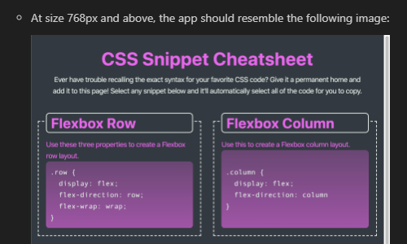

# CSS Cheat Sheet

## Description

This project contains **advanced CSS features** and semantic HTML elements for
accessibility. It is structured with a **responsive grid layout** using flexbox
and media queries. The CSS properties incorporated include **linear-gradient**
background, **::selection** to enable font highlighting, and **transition** to
add some animation.

## Installation

This project can be accessed through GitHub and does not require further
installation.

## Usage

View the full HTML and CSS code base from the repository.

A template was provided to demonstrate the recommended layout and design. The
HTML and CSS code needed to be written to meet these requirements.

View the full application live via the following link:
https://christinelea.github.io/CSS-CheatSheet/

## Roadmap

Upcoming features is enable for users a way in which to add additional CSS
snippets and display them on the page.

## Authors and acknowledgment

Acknowledgment to the Monash University, Melbourne, edX boot camp course which I
am currently undertaking.

## License

MIT License
